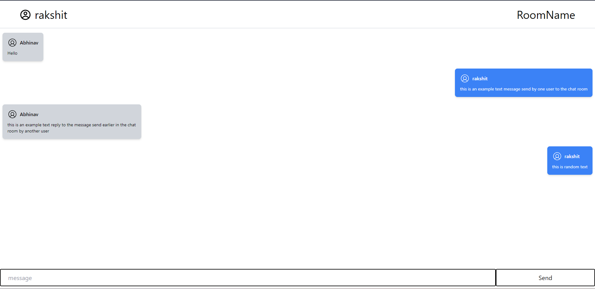

# Chat-App

A basic chat app made using sockets and node js for the backend and React for the Front End,
which is containrised using Docker 


## Run Locally

Clone the project

```bash
  git clone https://github.com/rakshit0960/Chat-App.git
```

Go to the project directory

```bash
  cd Chat-App
```

Start the server for production

```bash
  docker compose up
```

## 🛠 Skills
NodeJS, Socket.io, React, Typescript, Docker, docker-compose

## Screen Shots

